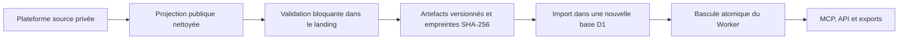

# AgentVegan Public Data

<!-- mcp-name: org.agentvegan/public-data -->

Service public, gratuit pour l’utilisateur, sans compte et en lecture seule pour explorer les recettes véganes AgentVegan, les ingrédients canoniques, la nutrition sourcée, les substitutions culinaires, les enseignes et les produits végétaux en France.

- MCP distant : `https://mcp.agentvegan.org/mcp`
- API REST : `https://mcp.agentvegan.org/api/v1`
- OpenAPI : `https://mcp.agentvegan.org/openapi.json`
- Exports : `https://mcp.agentvegan.org/exports/v1/manifest.json`

Le code est sous licence MIT. Les données conservent leurs droits et licences source par source ; il n’existe aucune licence globale appliquée aux recettes, marques, fiches commerciales ou images.

## Installer

### Claude

Une fois le Worker public déployé, ajoutez dans les réglages de connecteurs l’URL `https://mcp.agentvegan.org/mcp`. Aucun OAuth ni clé API n’est demandé.

### ChatGPT

Le plugin MCP-only AgentVegan est prêt pour la soumission au répertoire OpenAI. Une URL MCP personnalisée ne suffit pas à garantir l’usage sur ChatGPT Free. La mention « compatible ChatGPT Free sur le web en France » reste interdite tant que l’app n’a pas été approuvée puis testée sur un compte Free vierge.

### Développeurs et clients MCP locaux

Après publication du paquet npm :

```bash
npm install -g @agentvegan/public-data-mcp
agentvegan-public-data mcp-stdio
```

Exemples CLI :

```bash
agentvegan-public-data find-stores tahini --status listed
agentvegan-public-data find-substitutes oeuf
agentvegan-public-data search-recipes --nutrient iron_mg --nutrient-minimum 5 --max-time-minutes 30
agentvegan-public-data compare-nutrition tofu,seitan --basis 100_g
```

## Architecture et sécurité des données



Le Worker ne lit jamais la plateforme personnelle, ses sessions commerçantes, ses D1/R2 ni ses fichiers internes. Une version invalide ne remplace jamais la dernière version saine. Les journaux ne contiennent ni prompts, ni corps de requête, ni paramètres, ni données personnelles : uniquement route générique, statut et latence.

## Données et contrat

Les huit entités publiques sont `Recipe`, `Ingredient`, `Nutrient`, `Retailer`, `AvailabilityEvidence`, `SubstitutionRule`, `PlantProduct` et `SourceReference`. Chaque réponse API et outil MCP suit le contrat : `dataset_version`, `data`, `next_cursor`, `sources`, `coverage_warnings`, `checked_at`. Les listes sont limitées à 50 éléments.

La version actuelle contient 431 recettes, 545 ingrédients canoniques, 21 nutriments, 30 enseignes, 14 756 preuves, 53 substitutions et 517 produits végétaux. Ces minima sont contrôlés par le build ; une perte de couverture bloque la publication.

## Développement

Prérequis : Node.js 22 ou plus récent.

```bash
npm ci
npm run data:sync
npm test
```

Le transport distant est Streamable HTTP et le serveur utilise le SDK MCP TypeScript officiel v2. Les neuf outils sont annotés lecture seule, non destructifs et idempotents.

## Déploiement atomique

1. Générer et valider la projection dans `agentvegan-landing`.
2. Exécuter `npm run data:sync`, qui vérifie le hash, les minima, les exports et génère des lots D1.
3. Créer une nouvelle base D1 portant la version du dataset, appliquer les migrations puis importer tous les lots avec `npm run d1:import:remote`.
4. Vérifier les compteurs et les parcours réels sur cette base.
5. Remplacer `database_id` dans `wrangler.jsonc` puis déployer le Worker. La bascule du binding ne survient qu’avec le nouveau déploiement ; l’ancienne version reste saine jusque-là.
6. Conserver la base précédente pour rollback, puis la retirer lors d’une opération séparée après observation.

Le déploiement refuse le placeholder D1 et nécessite une session Wrangler authentifiée.

La phase initiale utilise explicitement Workers Free : 100 000 requêtes par jour et la limite Cloudflare de 10 ms CPU par invocation. D1, les caches, la limitation anti-abus et toutes les validations restent actifs. Les erreurs CPU, les `429`, la latence et les volumes doivent être observés ; une saturation ou des dépassements CPU déclenchent le passage à Workers Paid, sans masquer les erreurs ni réduire le contrat de données.

## Confidentialité, limites et contact

- Politique : `https://mcp.agentvegan.org/privacy`
- Conditions et licences : `https://mcp.agentvegan.org/terms`
- Aide : `https://mcp.agentvegan.org/support`
- Contact : `support@agentvegan.org`

La disponibilité est une observation datée, pas une garantie de stock. Le catalogue de produits végétaux reste en cours de constitution. Les informations nutritionnelles ne remplacent pas un avis médical.
